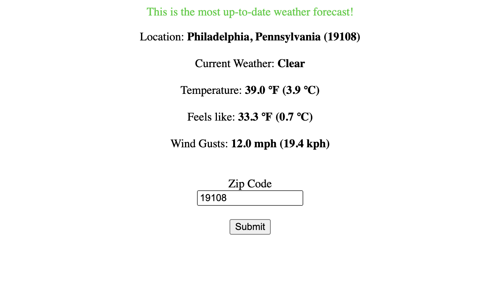
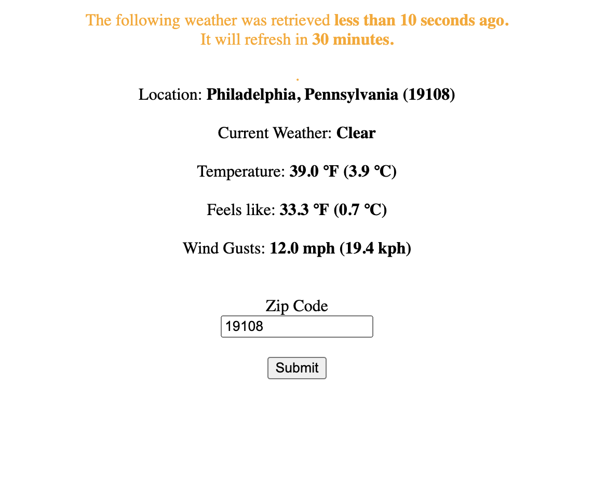
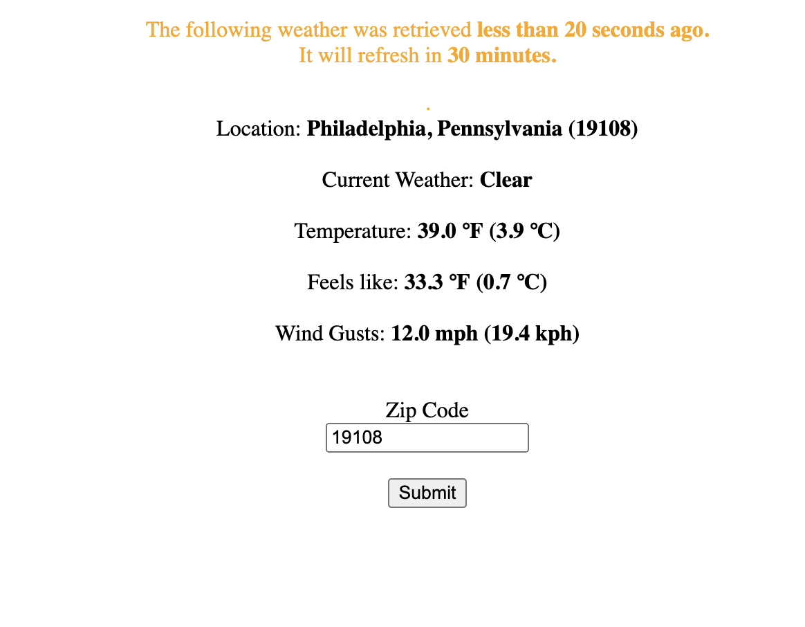
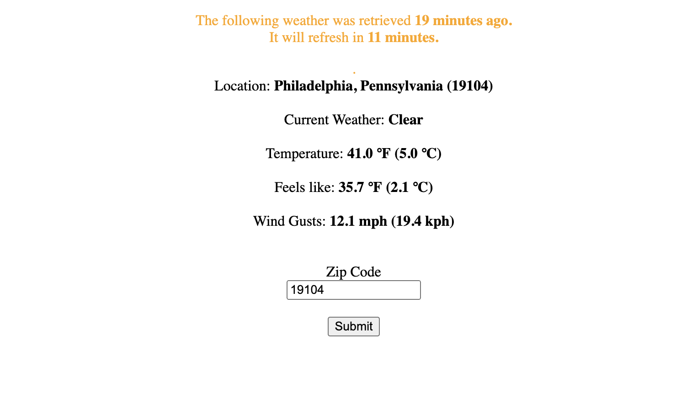

# README

## Weather Tool

This repository holds a weather tool, through which a zip code is inputted, and the current weather is outputted.

If this zip code's weather has been fetched within the last 30 minutes, the cached weather is shown along with an indication of how much time is left before updated weather is fetched.

If it has not been accessed within the last 30 minutes, the most up-to-date weather is fetched from the weather API and shown.

If the zip code is invalid, or if the API gives an error, an appropriate error message is shown.

Many further things could be done with this project, such as an extended weather forecast, and an expanded test suite for the view.

However, for the sake of time, I decided not to go further.

## SETUP
1. Clone the repository
2. Run `bundle install`
3. Run `rails db:create`
4. Run `rails db:migrate`
5. Create a `.env` file in the root directory, and copy/paste what is inside of `.env.sample` into it.
6. Fire up the server: `rails s`
7. Proceed to `localhost:3000` and play around with the app!

## A few notes

- Caching in the database is sufficient for a demonstration of caching logic, however, as scale is reached, Redis will be much faster, and easy to implement.
- As this app scaled and/or expanded, I would like to use the VCR gem for recording actual API responses in the test suite, instead of copy/pasting the main part of the response into the specs like I did. However, for this sample application, I didn't consider it necessary to implement the VCR gem.
- While in development, I used a .ENV file to store the API key for the weather service - since I have no way of giving the project reviewer
the API key, I chose to paste this key directly into a .env.sample file. This should never be done in a production environment,
but as stated above, I have no other way of passing the API key to the tester.
- Chose JSONB for weather instead of JSON because JSONB is faster for reads, and thus will perform better with scale.

## Some Screenshots:

Newly fetched weather:

Fetched 10 seconds ago:

Fetched 20 seconds ago:

Fetched 19 minutes ago:

